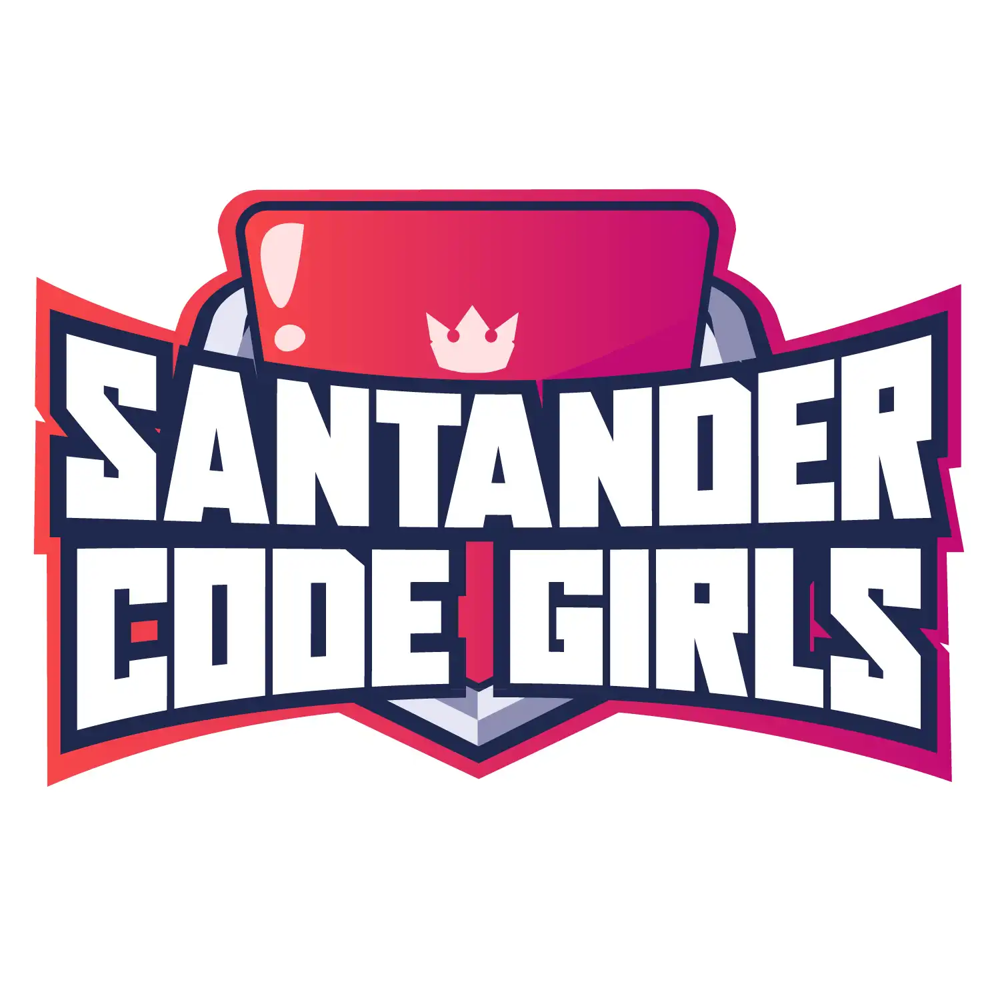

<h1 align="center"> Bootcamp Code Girls - AWS Cloud Foundations </h1>

  

  
  <a href="#-screenshots">Screenshots</a>&nbsp;&nbsp;&nbsp;|&nbsp;&nbsp;&nbsp;
  <a href="#-technologies">Technologies</a>&nbsp;&nbsp;&nbsp;|&nbsp;&nbsp;&nbsp;
  <a href="#-license">License</a>&nbsp;&nbsp;&nbsp;|&nbsp;&nbsp;&nbsp;
  <a href="#-contributing">Contributing</a>&nbsp;&nbsp;&nbsp;|&nbsp;&nbsp;&nbsp;
  <a href="#support">Support</a>  

## 📸 Screenshots

  

 

## 🛠 Technologies

This project focuses on AWS Cloud Foundations. Examples of technologies and tools used or recommended to learn:

- Cloud provider:
  - AWS: S3, EC2, Lambda, API Gateway, VPC, Route 53, IAM, CloudWatch, X-Ray
- Infrastructure as Code (IaC):
  - Terraform, AWS CloudFormation, AWS CDK, Pulumi
- Containers & Orchestration:
  - Docker, Amazon ECS, AWS Fargate, Amazon EKS (Kubernetes)
- Serverless:
  - AWS Lambda, AWS SAM, Serverless Framework
- Databases:
  - Amazon RDS (Postgres/MySQL), Amazon DynamoDB, Amazon Aurora
- CI/CD & Automation:
  - GitHub Actions, AWS CodePipeline, AWS CodeBuild
- Observability & Monitoring:
  - Amazon CloudWatch, AWS X-Ray, Prometheus, Grafana
- Security:
  - AWS IAM, AWS KMS, AWS Secrets Manager, AWS WAF, GuardDuty
- Development & SDKs:
  - AWS CLI, boto3 (Python), aws-sdk (Node.js), Terraform CLI
- Local testing & tooling:
  - LocalStack, pytest, jest

 

## 📜 License

- This project is licensed under the [MIT License](https://choosealicense.com/licenses/mit/)

 

## 🫱🏻‍🫲🏻 Contributing

 Contributions, issues, and feature requests are welcome! Please, feel free to do it! 😉 

 

## 🌟 Support

 If you like this project, please give it a star ⭠and share it with others! 😄 

