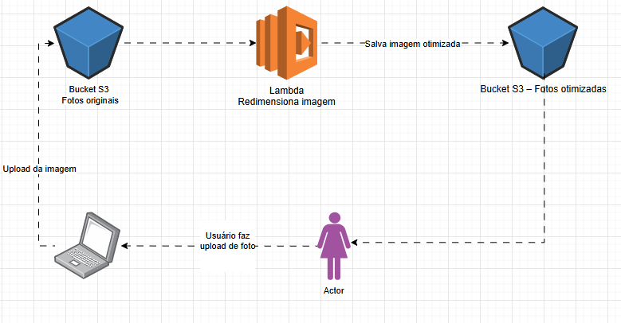

# Desafio AWS - Integração S3 + Lambda

Este projeto é uma demonstração prática de integração entre Amazon S3 e AWS Lambda.  
O objetivo é mostrar um fluxo serverless de processamento automático de arquivos.

## Cenário de exemplo

Imagine um site de fotos:

1. O usuário faz upload de uma imagem.
2. A imagem é armazenada em um bucket S3 de entrada.
3. Um evento do S3 dispara uma função **Lambda, que redimensiona a imagem automaticamente.
4. A imagem otimizada é salva em um bucket S3 de saída.

Fluxo simplificado:
Usuário → S3 (upload de imagem) → Lambda (redimensiona imagem) → S3 (versão otimizada)

# Imagem do Fluxo

