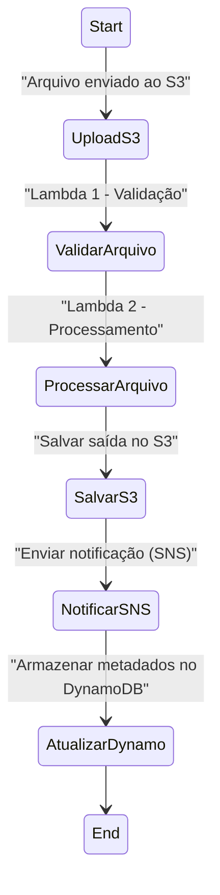

# AWS Step Functions - Workflow Automatizado

Este repositório contém minhas anotações e experimentos práticos realizados no laboratório da [DIO](https://www.dio.me/) sobre AWS Step Functions.  

Este laboratório tem como objetivo consolidar o aprendizado sobre orquestração de processos serverless com AWS Step Functions. O entregável é um repositório organizado contendo anotações e insights adquiridos durante a prática, servindo como material de apoio para os seus estudos e futuras implementações.

## 📌 Objetivos da Aprendizagem
- Aplicar conceitos aprendidos sobre AWS Step Functions em um ambiente prático.  
- Documentar os processos de forma clara e estruturada.  
- Utilizar o GitHub como repositório de documentação técnica.  

## 🛠️ Serviços Utilizados
- **AWS Step Functions** → para orquestrar o fluxo.  
- **AWS Lambda** → funções responsáveis pelas tarefas individuais.  
- **Amazon S3** → armazenamento de dados (arquivos de entrada/saída).  
- **SNS/SQS/DynamoDB** → dependendo do fluxo construído.  

## 📊 Diagrama (Mermaid)

