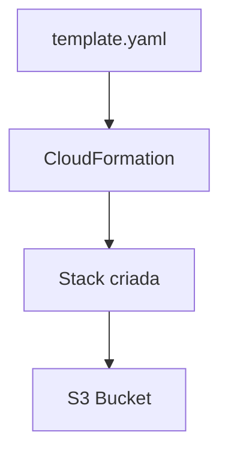

# Lab com AWS CloudFormation

Este repositório contém minhas anotações e experimentos práticos realizados no laboratório da [DIO](https://www.dio.me/) sobre **AWS CloudFormation**.

 

## 📌 Objetivo

O objetivo deste projeto foi criar uma Stack na AWS utilizando **CloudFormation**, entendendo como declarar e provisionar recursos de forma automatizada.

 

## 🛠️ Template YAML

Cria um bucket no S3 com nome único baseado no seu AccountId.

 

## 📊 Arquitetura do Lab

 

## 📎 Referências
- [Documentação AWS CloudFormation](https://docs.aws.amazon.com/cloudformation/)
- [Guia da DIO sobre CloudFormation](https://web.dio.me/)
