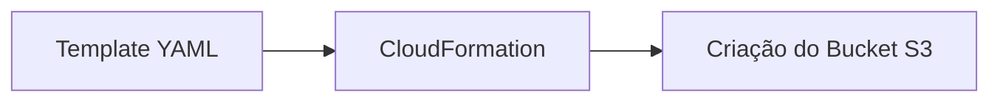

# ☁️ Laboratório AWS CloudFormation - S3 Bucket

Neste projeto, o objetivo foi criar uma infraestrutura automatizada utilizando **CloudFormation**, aplicando os conceitos estudados e documentando toda a experiência. Este projeto faz parte do portfólio da DIO.

## 🧠 Conceitos Abordados

- Infraestrutura como Código (*Infrastructure as Code - IaC*)  
- AWS CloudFormation  
- Buckets S3  
- Templates YAML  
- Criação de Stacks e gerenciamento de recursos na AWS  
- Versionamento e documentação técnica via GitHub  
- Documentação de insights e aprendizados

## 📌 Objetivo do Projeto

Criar um **bucket S3** na AWS utilizando um template YAML de CloudFormation, seguindo boas práticas de documentação e organização para portfólio, e registrar aprendizados em **insights/insights.md**.

## 🔧 Recursos Utilizados

- **AWS CloudFormation**: criação automatizada de infraestrutura  
- **AWS S3**: armazenamento na nuvem  
- **GitHub**: versionamento e documentação do projeto  
- **Mermaid**: diagrama ilustrativo do fluxo de criação  

## 📊 Diagrama do Fluxo (Mermaid)

## 📎 Referências

- AWS CloudFormation Documentation
- AWS S3 Documentation
