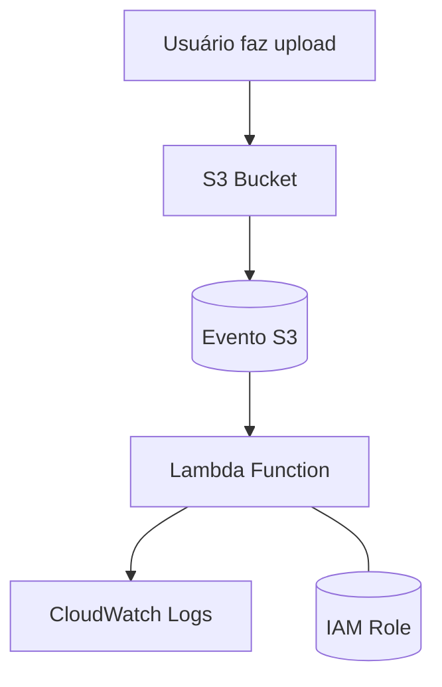

# 🚀 Laboratório AWS – Automação com Lambda + S3

Este repositório documenta a prática realizada no laboratório de AWS focado em automação por meio de **AWS Lambda** a partir de eventos disparados pelo **Amazon S3**. O objetivo foi consolidar conceitos de arquitetura serverless na AWS, explorando o ciclo completo: evento → gatilho → execução → logs.

---

## 🧠 Objetivo do Desafio

Criar uma Lambda Function configurada para ser acionada automaticamente quando um arquivo for enviado a um bucket S3, registrando o evento e demonstrando o funcionamento da arquitetura baseada em eventos (event-driven architecture).

---

## 🏗️ Arquitetura (Mermaid - visão geral)

## ☁️ Serviços AWS utilizados

| Serviço        | Uso                               |
|---------------|-------------------------------------|
| S3            | Armazenamento e geração do evento   |
| Lambda        | Execução automatizada               |
| IAM           | Permissões e papéis                 |
| CloudWatch    | Registro de logs da função          |

## 🔐 Permissões IAM necessárias

AWSLambdaBasicExecutionRole
Política com permissão de leitura no bucket S3 utilizado

## 📝 Passo a Passo (resumo)
1. Acesse o console da AWS
2. Crie um bucket no Amazon S3
   - Escolha um nome único global
   - Selecione a região desejada
3. Crie uma função Lambda
   - Selecione Python ou Node.js
   - Use o handler padrão
4. Crie um Role no IAM
   - Adicione `AWSLambdaBasicExecutionRole`
   - Conceda permissão ao S3 (GetObject, ListBucket)
5. Associe o gatilho do S3 à Lambda
   - Evento: PUT (upload)
6. Faça upload de um arquivo no bucket
7. Acesse o CloudWatch e visualize os logs

## 📎 Referências
- [Documentação AWS CloudFormation](https://docs.aws.amazon.com/cloudformation/)
- [Guia da DIO sobre CloudFormation](https://web.dio.me/)
