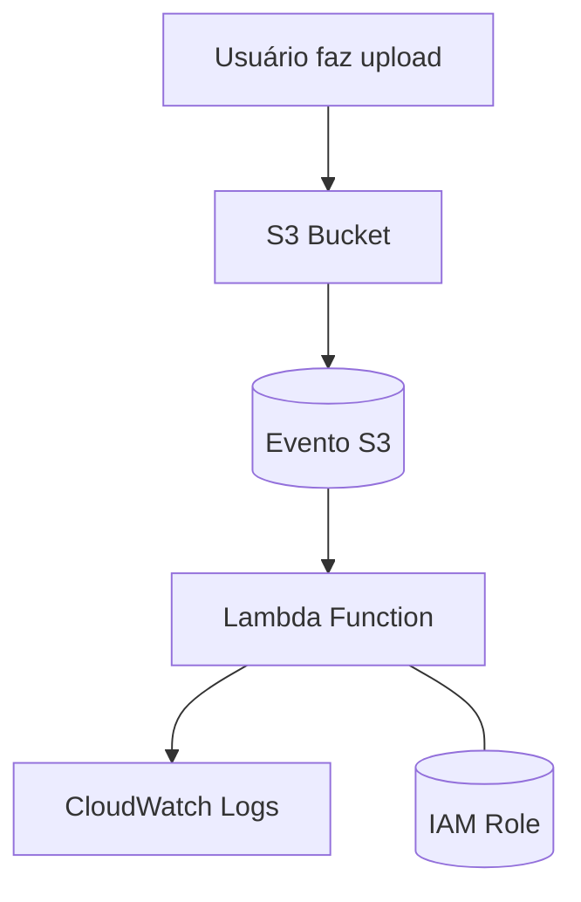

# 🚀 Laboratório AWS – Automação com Lambda + S3

Este repositório documenta a prática realizada no laboratório de AWS focado em automação por meio de **AWS Lambda** a partir de eventos disparados pelo **Amazon S3**. O objetivo foi consolidar conceitos de arquitetura serverless na AWS, explorando o ciclo completo: evento → gatilho → execução → logs.

---

## 🧠 Objetivo do Desafio

Criar uma Lambda Function configurada para ser acionada automaticamente quando um arquivo for enviado a um bucket S3, registrando o evento e demonstrando o funcionamento da arquitetura baseada em eventos (event-driven architecture).

---

## 🏗️ Arquitetura (Mermaid - visão geral)

## ☁️ Serviços AWS utilizados

| Serviço        | Uso                               |
|---------------|-------------------------------------|
| S3            | Armazenamento e geração do evento   |
| Lambda        | Execução automatizada               |
| IAM           | Permissões e papéis                 |
| CloudWatch    | Registro de logs da função          |